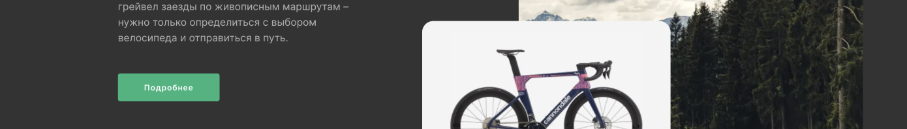

# Competition Project

## contents

- [about this project](#about-this-project)
- [what we've learnt doing this project](#what-weve-learnt-doing-this-project)

## about this project

This project was created to participate in a local competition among our fellow students during the practicum course. The main purpose of this project was to help us understand how to work together as a team in a short amount of time. Not only did we achieve that goal, but we also gained a better understanding of how to work with `git` branches, commits, and pushes together.

In the end, we were able to successfully complete all the goals set for the project and score 🏆 **27 points out of 30** judged by:
- Functionality
- Syntax
- BEM
- Accessibility
- CSS
- Responsive-design (extra points)

This experience taught us a lot about teamwork, communication, and version control. We are grateful for the opportunity to work together and for the lessons we learned along the way.

## what we've learnt doing this project

Throughout the project, we learned how important it is to communicate effectively and work collaboratively. By working on this project, we were able to identify our individual strengths and weaknesses and find ways to complement each other's skills. This not only improved our workflow but also made the experience more enjoyable.

When it came to `git`, we learned the importance of proper version control and how it can make or break a project. We made sure to communicate any changes we made to the codebase and to review each other's work before merging. This helped us avoid any potential conflicts and ensured that our code was always up-to-date.

---

&hearts; thanks to yandex practicum team
